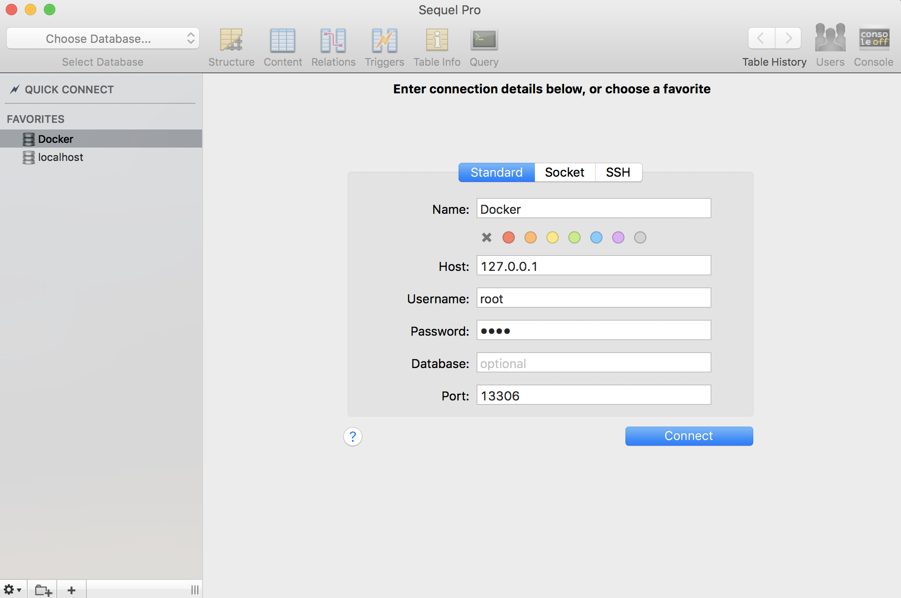

## Laravel Starter - Docker for PHP Developers

A Laravel starter project for Docker using Nginx and PHP-FPM. This project is an opinionated approach to organizing Docker in a PHP project and demonstrates separating configuration and code for containers.

## Setup

To start using this project, there are a few setup steps that you need to take which include things like composer installation and setting up env files.

Here's the commands you need to run to get going:

```
# From the root of the project

# Copy the example env files
cp .env.example .env
cp .docker.env.example .docker.env

# Install composer dependencies
composer install

# Generate a key
php artisan key:generate

# Install frontend code
yarn && yarn dev

# Or if you use NPM
npm install && npm run dev

# Build the Docker images and run containers in the background
# Omit the `-d` flag if you want to run in the foreground
docker-compose up --build -d

# If you run in the background, you can see the logs with:
docker-compose logs -f

# Migrate the database in the container
docker-compose run --rm app /bin/bash

# Now inside the container
php artisan migrate
```

## Connecting to the Database

When you have the Docker environment running you can connect to a database via a GUI application or MySQL command line. Here's how you would connect from the console, for local development:

```
mysql -u root -proot -P13306 -h 127.0.0.1
```

The `docker-compose.yml` file contains the environment configuration for the MySQL database name, users, and root password for reference. The `mysql` service in the Docker Compose file maps port `13306` on the host machine to `3306` on the container so that it doesn't interrupt any local MySQL instances you might have running. I've just added a `1` in front of the `3306` as `13306` if you want an easy way to remember the port exposed for MySQL.

Here's what a Sequel Pro connection might look like:



## Code Organization

The source code is a Laravel 5.5 project with the Docker configuration needed to run application containers, schedulers, and queues. Here is an overview of the Docker file organization. All of the Docker setup files are located in the `docker/` folder, with the exception of the `docker-compose.yml` and `.docker.env.example` file.

Here is a quick overview of the Docker setup files:

```
docker/
├── Dockerfile
├── confd
│   ├── conf.d
│   │   └── nginx-default.toml
│   └── templates
│       └── nginx-default.tmpl
├── nginx
│   └── h5bp
├── php
│   ├── composer-installer.sh
│   ├── conf.d
│   │   ├── opcache.ini
│   │   └── xdebug.ini
│   ├── php-fpm.d
│   │   └── docker.conf
│   └── php.ini
├── run-app.sh
└── supervisor
    ├── conf.d
    │   ├── app.conf
    │   ├── queue.conf
    │   └── scheduler.conf
    └── supervisord.conf
```

### The Dockerfile

The `Dockerfile` is used to build the PHP image that runs the Laravel application.

### Confd

The `confd` folder contains configuration files and templates for [confd](https://github.com/kelseyhightower/confd), which is used to separate configuration and code in containers. This starter project contains one example of this in action: you can use environment to change the Nginx `server_name` directive.

For example, when the container starts, the `docker/run-app.sh` file runs `confd -onetime -backend env` which then creates the `/etc/nginx/sites-available/default` file, using the `NGINX_SERVER_NAME` environment variable to set the `server_name`. If you were to set `NGINX_SERVER_NAME=example.dev`, the output would be:

```
server {
    # This template tag
    server_name {{getenv "NGINX_SERVER_NAME"}};
    
    # Will become...
    server_name example.dev
}
```

### Nginx

The `nginx/` folder contains HTML 5 Boilerplate configuration for Nginx servers (basic configuration).

The basic configuration includes the following, which are pretty self-evidient:

```
# Basic h5bp rules

include h5bp/directive-only/x-ua-compatible.conf;
include h5bp/location/expires.conf;
include h5bp/location/cross-domain-fonts.conf;
include h5bp/location/protect-system-files.conf;
```

### PHP

The `php` folder contains PHP INI configuration files for Xdebug and Confd. You can add your own `.ini` files to the `docker/php/conf.d/` folder, and PHP will read them when you build the Docker image.

The `docker/php/conf.d/xdebug.ini` file demonstrates how you can use environment variables to control Xdebug, which allows each developer the ability to modify these settings however he or she sees fit.

The `docker/php/conf.d/opcache.ini` file is an important configuration file to check out. If you set the environment variable `PHP_OPCACHE_VALIDATE_TIMESTAMPS=0`, your file modifications will not be recognized. This is the defaut and recommended setting for production. In development, as you will see in the `.docker.env.example` file, the value `PHP_OPCACHE_VALIDATE_TIMESTAMPS=1` ensures that each new change will be recognized in development. You should read through each setting carefully and adapt to your project needs.

The `docker/php/php-fpm.d/docker.conf` file configures PHP-FPM to listen on a Unix socket, which is then configured in Nginx.

### run-app.sh

The `docker/run-app.sh` file is copied into the container and is configured as the following in the `docker/Dockerfile`:

```
CMD ["/usr/local/bin/run-app"]
```

The `run-app.sh` file runs `supervisord` to run the webserver, scheduler, and queue, but before executing supervisord, the script will prepare the runtime environment.

First, if the `APP_ENV` is not `local`, then a few `artisan` commands are executed, specifically `php artisan config:cache` and `php artisan route:cache`. Non-development environments shouldn't have Xdebug configured as a module, so the `run-app.sh` script removes all Xdebug INI files when `APP_ENV` is not `local`.

Next, if you are having permission issues on Linux systems, you can set the `DEV_UID` environment variable to allow Docker to modify files like cache, etc. If you are on OS X, you should not have to configure `DEV_UID`. You can get your local user UID by running `echo $UID` from the command line, and setting the value in the `.docker.env` file.

You can configure the `CONTAINER_ROLE` environment variable, which changes how the container will run. This allows one image to run as an application server, or a scheduler, or a queue. This means that you don't have three separate builds. Based on container role, the `run-app.sh` file will symlink the appropriate supervisor configuration based on the type of container you want to run.

### Supervisor

The `supervisor/` folder contains three configuration files in `docker/supervisor/conf.d`, and a main `supervisord.conf` file.

The `docker/supervisor/conf.d` configuration files include `app.conf`, `queue.conf`, and `scheduler.conf`. Based on the `CONTAINER_ROLE` environment variable, the `run-app.sh` script will symlink the right conf file in place at runtime.

When running as a web server, `supervisord` runs both Nginx and PHP-FPM, which communicate via a Unix socket.

You might find the `docker/supervisor/conf.d/scheduler.conf` file the most interesting:

```
[program:laravel-scheduler]
user=www-data
command=bash -c "while true; do php /var/www/html/artisan schedule:run --verbose --no-interaction & sleep 60; done"
autostart=true
autorestart=true
redirect_stderr=true
stdout_logfile=/dev/stdout
stdout_logfile_maxbytes=0
stderr_logfile=/dev/stderr
stderr_logfile_maxbytes=0
```

The `command` property is an infinite bash loop that runs the `artisan schedule:run` command in the background, and then sleep for `60` seconds before running the `artisan schedule:run` command again. The bash loop keeps the process running in the foreground, and acts like a cron to run the scheduler in a Docker container.

## License

THE SOFTWARE IS PROVIDED "AS IS", WITHOUT WARRANTY OF ANY KIND, EXPRESS OR IMPLIED, INCLUDING BUT NOT LIMITED TO THE WARRANTIES OF MERCHANTABILITY, FITNESS FOR A PARTICULAR PURPOSE AND NONINFRINGEMENT. IN NO EVENT SHALL THE AUTHORS OR COPYRIGHT HOLDERS BE LIABLE FOR ANY CLAIM, DAMAGES OR OTHER LIABILITY, WHETHER IN AN ACTION OF CONTRACT, TORT OR OTHERWISE, ARISING FROM, OUT OF OR IN CONNECTION WITH THE SOFTWARE OR THE USE OR OTHER DEALINGS IN THE SOFTWARE.
